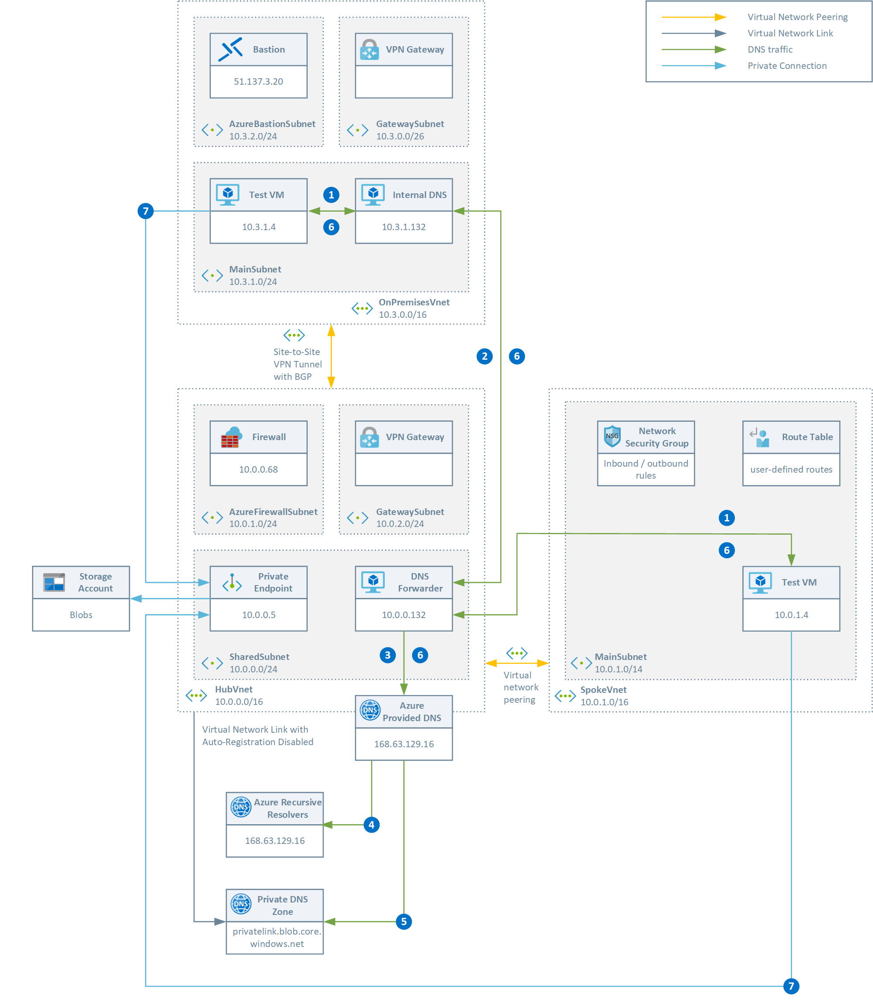

# Introduction #

This sample demonstrates how to handle Azure Private Endpoints provisioning and deprovisioning events with Azure Event Grid

## Scenario ##

Consider a scenario where a customer builds a hub-and-spoke topology connected to the corporate on-premises network via ExpressRoute or Site-to-Site VPN and where each application team has a dedicated subscription for their workloads. The system admnistrators define custom roles to define and assign a set of permissions to users in the context of their subscription or landing zone. Each application team has permissions on the resources defined in their subscription, but not on the bub subscriptions. In this hub-and-spoke topology, there is a single instance of each privatelink.* Private DNS Zone (e.g. privatelink.blob.core.windows.net for blob storage accounts) used for the name resolution of the Azure resources accessed via a private endpoint. As a consuequence, the users of applications team can create private endpoints in their subscription, or access the private endpoints defined in the hub virtual network, but they don't have the permissions to create or delete the necessary A records in the Private DNS Zones, located in the hub, to resolve the name of any Azure resource accessed via a private endpoint.
The following picture shows the DNS flow in this hub-and-spoke topology:

1. The virtual machine submits a DNS query for the FQDN of the azstore.blob.core.windows.net blob storage account
2. Conditional forward for azstore.blob.core.windows.net to the DNS server located in the HubVnet virtual network at 10.0.0.132
3. Server level forwarder to the Azure-provided DNS service at 168.63.129.16
4. Authoritative query for blob.core.windows.net. Received query: azstore.blob.core.windows.net Response: CNAME azstore.privatelink.blob.core.windows.net
5. Received query: azstore.privatelink.blob.core.windows.net Response: A Record 10.200.8.5
6. Response is sent back to the virtual machine: Response: CNAME azstore.privatelink.blob.core.windows.net + A Record 10.200.8.5
7. A private connection to 10.200.8.5 is established.

This topology has the following characteristics

- In the hub-and-spoke topology, there is a single instance of each privatelink.* Private DNS Zone (e.g. privatelink.blob.core.windows.net for blob storage accounts) used for the name resolution of private endpoints
- The privatelink.* Private DNS zones are all deployed in the shared services subscription that is the subscription hosting the hub virtual network
- A virtual network link exists between the hub virtual network and each of the privatelink.* Private DNS Zones
- All the spoke virtual networks are configured to use the DNS server\forwarder in the hub virtual network as DNS server
- Only the platform team (SysOps, NetOps, and SecOps) have write permissions on any resource in this centralized subscription.
- The users of the app teams are assigned a custom role that gives them read/write permissions on the Azure resources defined in their workload subscription, but no permissions to create or delete A records in the privatelink.* Private DNS Zones used for the name resolution of private endpoints in the hub virtual network.
- A virtual network link with auto-registration disabled exists between the hub virtual network and the privatelink.* Private DNS Zones.

This topology presents the following advantages and disadvantages:

### Pros ###

- Avoids the proliferation of Private DNS Zones across multiple subscriptions. You have a single instance of each privatelink.* Private DNS Zone used for the name resolution of private endpoints, one for each resource type, in the shared services/hub subscription.
- Provides visibility of private endpoints across multiple subscriptions as all the A records are in a single Private DNS Zone used by the DNS server in the hub virtual network that serves the DNS queries for Azure resources of all the virtual networks plus the DNS queries from the on-premises network (in our scenario this network is simulated by the on-premises virtual network connected to the hub virtual network via a S2S VPN).
- Private endpoints can be created in the CommonResources subnet in the hub virtual network. If:
  - the DNS server\forwarder in the hub is properly configured with conditional forwarding rules 
  - the Azure Firewall is properly configured to allows on-premises-to-spoke-vnet communications
Private endpoints can also be created in a spoke virtual network as shown in the above picture.

### Cons ###

- Using a single privatelink.* Private DNS Zone for all the private endpoints of the same kind implies having a single A record for each instance of a managed service via a private endpoint which in turn implies having only one private endpoint for each instance of a managed service across all the subscriptions.
- Centralizing the A records for all the private endpoints in a single Private DNS Zone could be a security risk as everyone with Microsoft.Network/privateDnsZones/A/read permission on the Private DNS zone can read the addresses of all the private endpoints, also those that are used in other workload subscriptions
- App team users can create or delete private endpoints in their subscriptions, but they don’t have the Microsoft.Network/privateDnsZones/A/read, Microsoft.Network/privateDnsZones/A/write and Microsoft.Network/privateDnsZones/A/delete permissions on the centralized privatelink.* Private DNS Zones, hence they cannot create or delete related A records necessary for the name resolution of private endpoints. This obliges to create an automated procedure to detect the provisioning and deprovisioning of private endpoints and of the related network interfaces and contextually create or delete related A record in the corresponding privatelink.* Private DNS Zone, depending on the resource type.

## Solution ##

The following event-driven solution based on Event Grid handles the events raised by an Azure subscription whenever a private endpoint, or better, the related NIC, gets created or deleted. The Azure Function runs with a system-assigned managed identity or service principal that has the necessary permissions (e.g. Reader built-in role over all the subscriptions) to read NIC information from any subscription, and also read, write and delete permissions on A records in the centralized privatelink.* Private DNS Zones.

The solution works as follows:

1. A private endpoint is created or deleted  in one of the satellite/spoke Azure subscriptions along with the associated network interface.
2. The Event Grid subscription is configured to handle only Microsoft.Resources.ResourceWriteSuccess and Microsoft.Resources.ResourceDeleteSuccess events types. In addition, the subscription makes use of advanced filtering to handle only events where data.operationName stringin Microsoft.Network/networkInterfaces/write Microsoft.Network/networkInterfaces/delete. So when a network interface is created or deleted in the Azure subscription, an event is sent to the Event Grid Subscription.
3. The Event Grid Subscription for Azure subscription events is configured to send events to a webhook exposed by an Azure Function hosted in the hub Azure subscription.
4. The Azure Function uses the [Fluent .NET Core library](https://github.com/Azure/azure-libraries-for-net) to create or delete an A Record Set in the proper Private DNS Zone hosted in a given resource group in the hub subscription. The Azure Function uses a System-Assigned Managed Identity to authenticate against the Azure AD tenant. This identity needs permissions on the following operations:  
   - scope: all subscriptions:
     - Microsoft.Network/networkInterfaces/read
   - scope: resource group in the hub subscription that contains the Private DNS Zones used with private endpoints:
     - Microsoft.Network/privateDnsZones/read
     - Microsoft.Network/privateDnsZones/A/read
     - Microsoft.Network/privateDnsZones/A/write
     - Microsoft.Network/privateDnsZones/A/delete

`NOTE: the solution assumes that all the Private DNS Zones used for the name resolution of the private endpoints are contained in the same resource group under the hub Azure subscription`

## Deployment ##

The solution contains the following artifacts:

- The code of the Azure Function under the **PrivateEndpointEventGridFunctionApp** folder. The Azure functions makes use of the Azure Function SDK for .NET Core 3.1.
- An ARM template under the **templates** folder to deploy the following Azure resources:
  - Azure Function App hosting your function
  - Application Insights used to monitor the performance and health status of the Function App
  - App Service hosting the Function App along with a system-assigned managed identity used by the function app to access Azure resources in the hub and spoke virtual networks.
- Under the **scripts** folder you can find a series of Bash scripts that you can use to deploy an Event Grid subscription for the Azure Function on Azure and debug the function locally on your machine using [ngrok](https://ngrok.com/) that allows your local machine to expose an HTTP/S endpoint that can be invoked by an Event Grid Subscription. For more information, see [Azure Function Event Grid Trigger Local Debugging](https://docs.microsoft.com/azure/azure-functions/functions-debug-event-grid-trigger-local).
